# Getting started with embeNET demo for NUCLEO-WL33CC1 board {#mainpage}

@tableofcontents

This document describes how to run the embeNET demo application on **NUCLEO-WL33CC1** boards.

## What you'll need

- PC with Windows
- One Nucleo-WL33CC1 board connected to the PC (via USB cable) that will act as the root of the network
- At least one more (up to 9) Nucleo-WL33CC1 boards that will act as the network nodes
- [embeNET demo package for Nucleo-WL33CC1](https://github.com/embetech-official/embenet-demo-nucleo-wl33cc1/releases)
- STM32CubeIDE, available for download from [the official ST site](https://www.st.com/en/development-tools/stm32cubeide.html) (for this demo version 1.17.0 was used)
- (optional)STM32CubeProgrammer available for download from [the official ST site](https://www.st.com/en/development-tools/stm32cubeprog.html)
- (optional)Any serial port terminal, for example [ExtraPutty](https://sourceforge.net/projects/extraputty), to view the logs. You can also use a [built-in terminal in CubeIDE](https://community.st.com/t5/stm32-mcus/how-to-use-the-stm32cubeide-terminal-to-send-and-receive-data/ta-p/49434).

Optionally, to play with the MQTT-SN demo service you'll need:
- Any MQTT-SN Gateway: we recommend the HiveMQ Edge, available for download from [the official HiveMQ page](https://www.hivemq.com/products/hivemq-edge)
- Any MQTT Client: we recommend the MQTT Client Toolbox from MQTTX, available for download from [the official MQTTX page](https://mqttx.app)

Optionally, to easily interact with the custom UDP service you'll need
- [UDP - Sender/Reciever app from Microsoft Store](https://www.microsoft.com/store/apps/9nblggh52bt0)

## Demo architecture

Picture below presents the architecture of the embeNET network presented in this demo.

<center>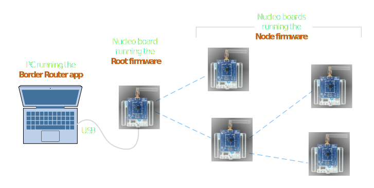</center>

The PC acts as a Border Router and becomes the gateway to the network. One Nucleo board runnig the Root firmware is connected to the PC via USB cable and acts as a network interface. The other Nucleo boards are running the Node firmware.
When running the Border Router application, it connects to the root using serial connection (COM in Windows) and a new network interface is registered in the system. All other Nucleo boards then join the network as nodes. Since embeNET is a true mesh network, every node in the network is a router and can extend the network through successive hops.

## The embeNET demo package

The [embeNET demo package for Nucleo-WL33CC1](https://github.com/embetech-official/embenet-demo-nucleo-wl33c1/releases) is distributed as a single ZIP file. Unzip it into a convenient location on disk. Inside you'll find a couple of folders:

- **doc** - contains this documentation
- **embenet_br** - contains the Border Router application to run on the PC
- **embenet_demo_src** - contains the firmware project in STM32CubeIDE for the Nucleo-WL33CC1 boards
- **embenet_demo_hex** - contains the already built firmware files for the Nucleo-WL33CC1 boards (Intel HEX format), that you can use without building them yourself
- **enms_visualizer** - contains a PC demo application that visualizes the network

## Programming the boards without building the firmware

A pre-build firware hex files are available inside the **embenet_demo_hex** folder. You can upload them to the boards using a tool of your choice. 
We recommend the STM32CubeProgrammer. Here are the steps needed to get started.

Download and install the [STM32CubeProgrammer](https://www.st.com/en/development-tools/stm32cubeprog.html)

Run the STM32CubeProgrammer tool and connect the Nucleo-WL33CC1 board to your PC. Next hit the "Connect" button.

<center>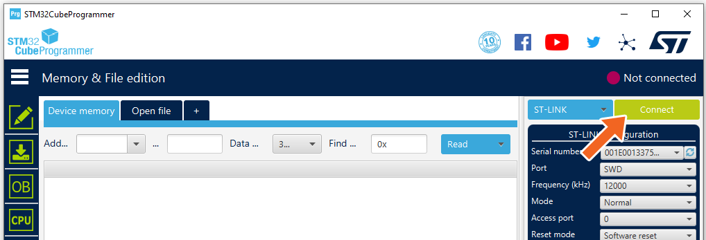</center>

You should see a log similar to this and a status that connection was successful.

<center>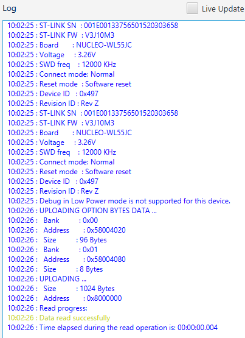</center>


Next hit the "Open file" button and select the firmware file you want to upload.

<center>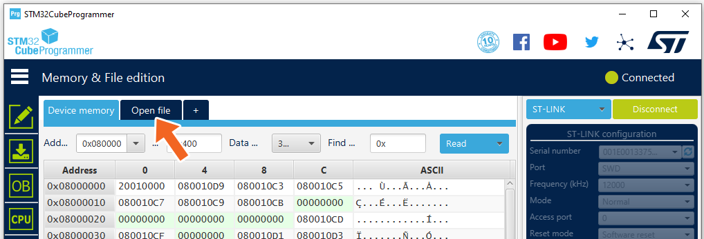</center>

Go to the embenet_demo_hex folder and select:
- **embenet_root_demo.hex** for the board acting as root node (Root firmware)
- **embenet_node_demo.hex** for all the other boards (Node firmware)

Finally hit the "Download" button to program the board.

<center>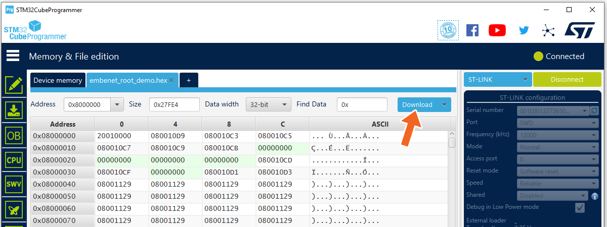</center>

A "File download complete" message should confirm that the firmware was properly downloaded.

<center>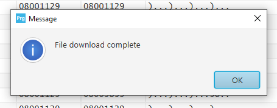</center>

Please note that by default the code will not run until you reset the board.

Now you should have one Nucleo board running Root firmware and at least one or more Nucleo boards running the Node firmware.


## Programming the board from the CubeIDE source code project

Download and install the [STM32CubeIDE](https://www.st.com/en/development-tools/stm32cubeide.html). 

Once you have it installed, open it and import the project located in **embenet_demo_src** folder. 

You should see and navigate a project called "embenet_node_demo".

<center>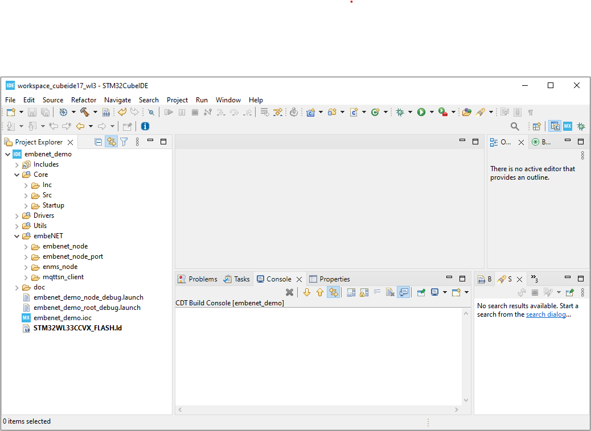</center>

Within the project there will be following folders:

- **Core** contains the application level files, including main.c
- **Drivers** contains CMSIS, BSP and STM32 HAL driver files
- **Utils** contains some utilities like CRC calculations, logger and ring buffer
- **embeNET** contains the embeNET Node library package including port and two services: ENMS and MQTT-SN (more on that later)

The project has four build configurations:

- **Node-debug** builds the firmware for the node with more detailed logging
- **Node-release** builds the firmware for the node with less detailed logging
- **Root-debug** builds the firmware for the root with more detailed logging
- **Root-release** builds the firmware for the root with less detailed logging

You can switch between the build configurations using the "Build Configurations" project option.

<center>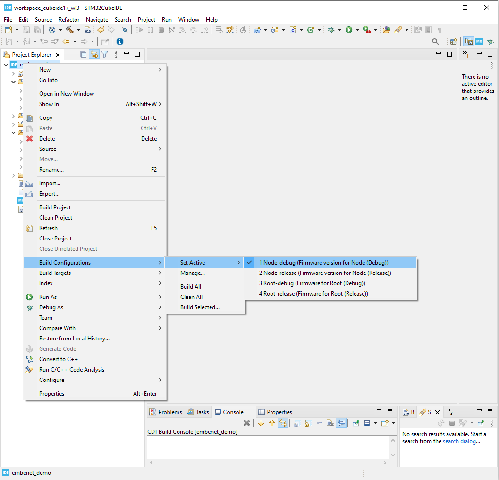</center>

### Building and deploying embeNET demo application on node

Right click on the project name and select "Build Configurations" -> "Set Active" -> "Node-release".
Build the demo application using the *Build project* option.

<center>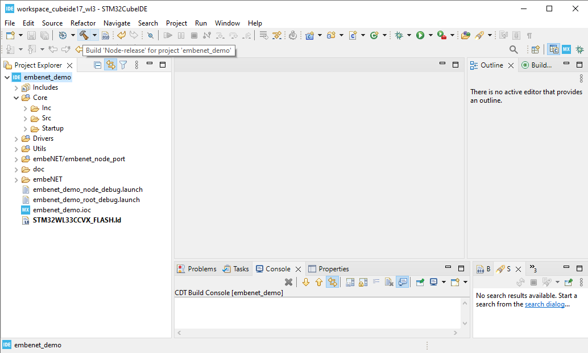</center>

The application should build without errors.
Connect the Nucleo board that should act as a node. From the *Run* menu select the **Node-release** configuration to program the board. If the configuration is not visible, mark it as favorite in the *Organize favorites...* menu

<center>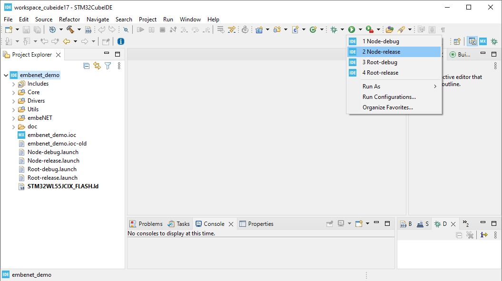</center>

### Building and deploying embeNET demo application on root

Right click on the project name and select "Build Configurations" -> "Set Active" -> "Root-release".
Build the demo application using the *Build project* option.

<center></center>

The application should build without errors.
Connect the Nucleo board that should act as a root. From the *Run* menu select the **Root-release** configuration to program the board. If the configuration is not visible, mark it as favorite in the *Organize favorites...* menu

<center>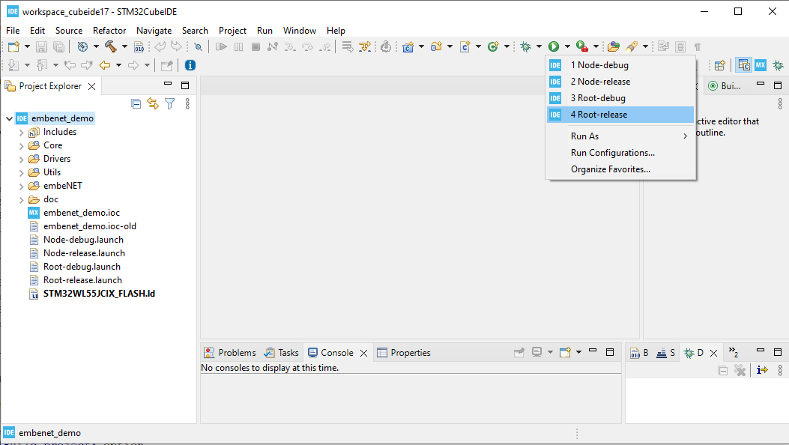</center>

## Logging tool

The Nucleo boards have an on-board ST-LINK programmer. Once connected to your computer the board will register in the system two ST-LINK Virtual COM Ports:
- STLink Virtual COM port (COMx)
- STLink Virtual COM port 2 (COMy)

Only the first one (COMx) is used.

To obtain log from the Node device you need to use a serial terminal (like Putty), and open connection to the COMx port, that the device uses with 115200 baurate (8N1).

Note that log from Root is not available through the Virtual COM Port because it is used to communicate with the Border Router application. 
Most of the time however this log is not needed, even during application development.

## Starting the Network

Once you have the boards programmed you can see the demo in action.

To start the network you need to connect the root Nucleo board to the PC. It should register as a COM port. 
Next go to the **embenet_br** folder and edit the *config.json* file that holds the border router configuration. The file will look similar to this:

```json
{ 
    "serial_port": "COMxx",
    "interface_name": "embeNET",
    "network": {
        "k1":     "0xc08b766277099e7d7e9c0222f168cc9e",
        "panid":  "0xe3be",
        "prefix": "0xaaaabbbbccccdddd"
    },

    "join_rules":  [
        {
            "uid": 0,
            "psk": "0x46d7dc94e8ee7496ceaf54a3ab64cbeb"
        }
    ]
}
```
The file has the following entries:
- *serial_port* - defines COM interface for the root node, in *COMxx* format.
- *interface_name* - defines the name of the network interface that will be created within the OS to communicate with the networked nodes
- *panid* - it is the 16-bit network identifier - it should be unique for each root
- *k1* is a 128-bit, network-wide key used to authenticate information exchange in the network. This key can be specific to the network or even whole organization.
- *prefix* - 64-bit IPv6 prefix of the wireless network
- *join_rules* - set of *join rules* that define which nodes can join the network (see below)

> Please edit the file to make sure that the *serial_port* entry matches the COM port registered for the root board.

### IPv6 address of the nodes

Each node in the network, including root has an IPv6 address consisting of two parts:

`prefix:uid`

where the *prefix* is set for the network in the *config.json* file and the *uid* is the 64-bit IEEE EUI-64 identifier, also know as the MAC address. In case of Nucleo-WL33CC1 boards it is printed on the ST-Link chip in the bottom-left part of the board, near the micro-USB socket.

### Join rules

Each node that wishes to join the embeNET network needs to be authorized by the built-in Authentication Authority. The authentication process uses a pre-shared key (*psk*), that needs to be configured in the nodes during commissioning. In the provided demo application firmware the key is hardcoded in main.c file.
During the authentication process both the *uid* and *psk* have to match what is defined in the *join_rules* in order to let the node join the network. However, when *uid* is set to 0, **EVERY node** with matching *psk* (pre-shared key) will be able to join the network. We call it the "zero rule". It is useful for testing and experimenting, however it should probably be disabled in the real deployment.

### Running the border router application

The network is started once you run the border router application **embenet_br.exe**. The application will try to connect to the root node and then manage the network.

This is a console application that will also log a lot of information about what is going on in the network and what packets are received from the nodes. Analyzing this log may help dealing with problems, if they arise during the further development process.

### Connecting the nodes

Once the border router application is running, all nodes within the communication range, should start to join the network. Be aware that this process may take couple of minutes depending on the network topology and the state of the nodes. For example: nodes that previously joined the network may require some time to notice that the border router was restarted before they attempt to join again.

## Virtual network interface

While running, the border router application registers a virtual network interface within Windows. The interface name will be set according to the *config.json* file. You can check the presence of this interface by running the standard Windows command:

`ipconfig`

Also, each connected node is reachable by ICMPv6 'ping'.

## Visualizing the network

The demo package includes an application that visualizes the network. It is called **enms_visualizer** and it is based on the ENMS service running in the background of the network. To use it simply run the application while the network is running. After a minute or so the ENMS messages will feed the application with the current state of the network, that will be visualized as a graph, spanning from the root node.

Exemplary topology with two nodes may look like this:

<center>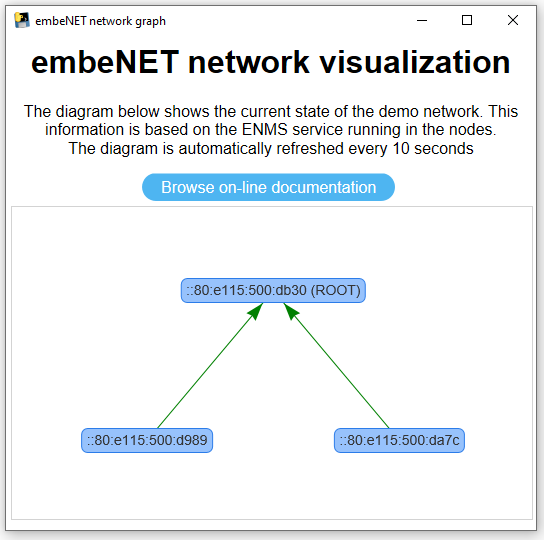</center>

## Network services

A network service in embeNET, is a separated piece of functionality built around the communication over a single UDP port (rarely - multiple UDP ports). Three examples of services distributed with the embeNET stack are:
- [ENMS: embeNET Network Management service](https://embe.net/docs/?q=doxyview/embeNET%20ENMS) that allows to gather information about the network operation from the nodes
- [MQTT-SN client service](https://embe.net/docs/?q=doxyview/embeNET%20MQTT-SN%20Client) that allows to use the popular MQTT publish/subscribe architecture in UDP networks and connect to standard MQTT brokers 
- [BOTA: Bulk-Over-The-Air service](https://embe.net/docs/?q=doxyview/embeNET%20BOTA) that allows to send large portions of data (for example - new firmware) between the nodes. **Note that BOTA service is not available in this demo**

The users however can easily develop their own services using UDP. An example of such a custom UDP service is implemented in the demo nodes.

## MQTT-SN demo service

The MQTT-SN demo service uses [MQTT-SN client](https://embe.net/docs/?q=doxyview/embeNET%20MQTT-SN%20Client) and does three things:
- periodically publishes uptime information using QoS 0
- on button press publishes button click event using QoS 2
- reacts to some simple text commands that control the on-boards LEDs - these commands are: *led1on*, *led1off*, *led2on*, *led2off*, *led3on* and *led3off* 

Refer to @ref mqttsn_demo for more information on how this service works and how to use it.

## Custom UDP service in the demo application

The custom service implemented in the demo works on UDP port number 1234. **Please note that this service works on remote nodes only - it is not available in root node**.
The service does two things:
- periodically sends a simple text message with counter to the border router node
- reacts to some simple text commands that control the on-boards LEDs - these commands are: *led1on*, *led1off*, *led2on*, *led2off*, *led3on* and *led3off*

There are many ways you can interact with UDP ports to test this service. One of the easiest is to use an application called [UDP - Sender/Reciever app from Microsoft Store](https://www.microsoft.com/store/apps/9nblggh52bt0). Once you run set the mode to *Sender/Receiver*. Next, in the *Remote IP* box input the IPv6 address of the remote node that you wish to communicate with. When using the default network prefix, this IP address will have the following form:

```
aaaa:bbbb:cccc:dddd:UID
```

where the **UID** will be the MAC address of the node.

In the *Remote Port* and *Local Port* boxes put port number: *1234*

Once you hit *Connect* you should see incoming text messages. You can also send some commands to light the LEDs on and off.


## Next steps

In order to get to know the internals of the demo and to modify or extend it refer to @ref internals_of_demo.

In order to test MQTT-SN part of the demo go to @ref mqttsn_demo.