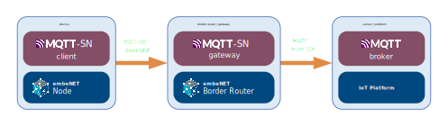
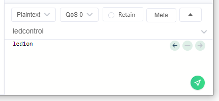

# Using MQTT-SN demo service {#mqttsn_demo}

@tableofcontents

This document describes the the MQTT-SN demo service running on **NUCLEO-WL33CC1** boards and provides information on how to use.
You can also dig deeper and read the @ref mqttsn_demo_code.

## What is MQTT-SN

MQTT-SN, or Message Queuing Telemetry Transport for Sensor Networks, is a lightweight and efficient messaging protocol 
designed for constrained environments, particularly suited for low-power, low-bandwidth, and high-latency networks. 
It is an extension of the widely adopted MQTT protocol, optimized to meet the specific requirements of sensor networks 
and other resource-constrained devices. 

Introduced as an open standard by IBM in 1999, MQTT originally targeted machine-to-machine communication in the context 
of industrial automation. As the Internet of Things (IoT) ecosystem expanded, the need for a more tailored protocol 
for highly constrained environments became evident. This led to the development of MQTT-SN, which addresses the challenges 
posed by devices with limited processing capabilities, memory, and power resources.

One of the primary advantages of MQTT-SN is its ability to facilitate seamless communication between sensor nodes 
and gateway devices, making it well-suited for scenarios where a hierarchical network structure is employed.
It achieves this by employing a broker-based publish-subscribe model, similar to its predecessor MQTT, 
allowing devices to exchange information without direct point-to-point connections. 

One of the most important technical aspects of MQTT-SN is that it uses the UDP transport protocol instead of TCP 
used in MQTT. It also uses topic IDs instead of topic strings allowing for shorter UDP datagrams, at the expense
of necessity to first register the topic in the gateway prior any usage.

## Architecture of the MQTT-SN system

The diagram below presents the architecture of a system using MQTT-SN over UDP:

<center></center>

The MQTT-SN enabled devices run [MQTT-SN Client](https://embe.net/docs/?q=doxyview/embeNET%20MQTT-SN%20Client) service 
on top of the embeNET Node library, which provides UDP networking.
These clients connect to a MQTT-SN Gateway which typically runs on the embeNET Border Router. It may however also run on any
other server reachable by networked clients. The gateway translates the UDP-based MQTT-SN protocol to a standard TCP-based
MQTT protocol and talks to a standard MQTT brokers, that are commonly found in IoT Platoforms such as Losant, 
MS Azure IoT Hub, AWS IoT and many other.

## How to set up the MQTT-SN demo

For this demo we will use:
- [HiveMQ Edge](https://www.hivemq.com/products/hivemq-edge/) as MQTT-SN Gateway
- [Mosquitto](https://test.mosquitto.org/) as MQTT broker
- [MQTTX](https://mqttx.app) as MQTT client on a PC

First setup the Gateway using [this simple tutorial](https://embe.net//docs/?q=doxyview/embeNET%20MQTT-SN%20Client/mqttsn_gateway_setup_hivemq_edge.html).

Once the gateway is up and running the messages from the demo nodes will be forwarded to the MQTT broker (Mosquitto).

## How to use the MQTT-SN demo

The easiest way is to set up a client on a PC. Download and install the [MQTTX](https://mqttx.app) application.

Once it is run press the **New connection** button to set up a connection to the MQTT broker.

@image html mqttx01.png

Next fill in the connection details:
- Name: **test** (whatever)
- Client ID: should be unique, leave autogenerated
- Host: **mqtt://test.mosquitto.org**
- Port: **1884**
- Username: **rw**
- Password: **readwrite**

@image html mqttx02.png

Then hit **Connect**. You should see that the client connected to the broker.

@image html mqttx03.png


### Subscribing to topics

Let's now subscribe to the topics, that the demo nodes publish to. There will be two topics:
**"uptime/<UID>"** and **"button/<UID>"** where the UID will be a 64-bit UID of the node spelled in HEX.

Knowing UID of the particular node we could subscribe to messages only from that node. However we can also
use MQTT wildcards to subscribe to all uptime and button messages from all nodes. Let's do that.
Hit the **New subscription** button and fill in the Topic as:
```
uptime/#
```
Where **#** will denote a wildcard on all UIDs.

@image html mqttx04.png

Hit **Confirm** and shortly you should see some uptime messages being displayed.

@image html mqttx05.png

Make a second subscription to a topic:
```
button/#
```

Now press the **B1 button** on the Nucleo board. You should see button messages popping in.

@image html mqttx06.png

### Publishing to topics

Our demo also allows to publish messages on a topic called **ledcontrol** to control the LEDs on the Nucleo board.
We can easily test it using the bottom window of the MQTTX app.

Fill in:
- topic: **ledcontrol**
- message: **led1on**

and press the green send button.

<center></center>

The LED on the Nucleo board should light up. Supported commands are: *led1on*, *led1off*, *led2on*, *led2off*, *led3on* and *led3off*.

## Implementation of the service

For deeper analysis of the demo service implementation go to @ref mqttsn_demo_code.